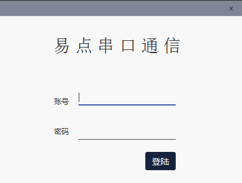
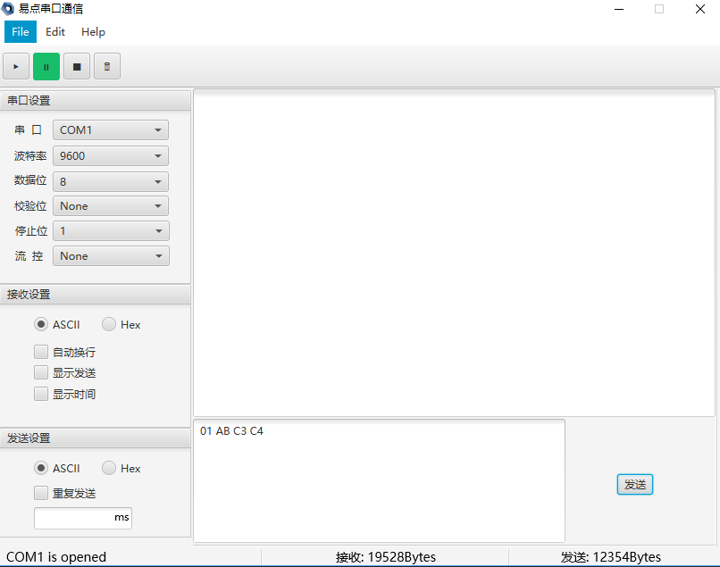

# DEBUGCOM
a software made by java and you can debug the serial ports of your program using it.  

# **login model**

# **main model**

# **functions description**
1.You extend it to adapt your projects . Because it is made by java , you change it easily.
2.You package it as a exe , msi and others easily , because it make by javafx.
3.It can be use in your projects based on Win , CentOs and Mac by choose the right jre(jdk).
4.In fact , it based on RXTXcomm.jar to communicate with com.

